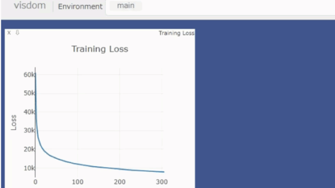

# Transformer-Repro
Transformer再現実装

## 概要
n番煎目のTransformer再現実装<br>
2017年「[Attention Is All You Need](https://arxiv.org/abs/1706.03762)」で発表されたTransformerを実装して英語から日本語に変換<br>
事前学習済み言語モデルを利用した場合とSentencePieceを利用した場合の2種類を実装

## 環境
`Ubuntu`, `CUDA 11.7`以上を推奨(PyTorch2.0以上を使用するため)

Anacondaを用いた仮想環境を利用
- Python:3.10
- PyTorch:2.01

`torch_ort`を使用するため, 事前にCUDA, CuDNNをインストール済みである必要。
[CuDNNインストールガイド](https://docs.nvidia.com/deeplearning/cudnn/install-guide/index.html)

以下のコマンドで仮想環境を再現可能。
``` bash
conda create -n transformer_env python=3.10 -y
conda activate transformer_env
conda install pytorch pytorch-cuda=11.7 -c pytorch -c nvidia -y
pip install optuna
conda install -c conda-forge onnx -y
conda install -c conda-forge onnxruntime -y
pip install onnxruntime
pip install onnxruntime-gpu
conda install -c conda-forge black -y
conda install -c conda-forge spacy -y
conda install -c anaconda pandas -y
conda install -c anaconda scikit-learn -y
conda install -c conda-forge torchdata -y
conda install -c pytorch torchtext -y
conda install -c conda-forge visdom -y
conda install -c anaconda nltk -y
conda install -c conda-forge gputil -y
conda install -c conda-forge pynvml -y
pip install torch-ort
export MKL_SERVICE_FORCE_INTEL=1
python -m torch_ort.configure
```

また、事前学習済み言語モデル利用するため、以下のコマンドでダウンロードしてください。
```bash
python -m spacy download ja_core_news_md
python -m spacy download en_core_web_md
```


## 引数指定ファイル
引数を[cfg.yml](./cfg.yml)で指定可能。記述例はconfigファイルを参照<br>

重要な引数一覧

|  引数  | 値                                                              | 説明                                 |
| ---- |----------------------------------------------------------------|------------------------------------|
|  mode  | **train** or **test** or **predict** or **onnx** or **optuna** | 学習 / テスト / 予測 / ONNXによる予測 / ハイパラ調整 |
|  data_mode  | **pretrain** or **sp**                                         | 事前学習済みモデル / SentencePiece          |
| visdom   | **True** or **False**                                          | Visdomを用いて学習状況を可視化するか              |
| data_limit   | 10**5 など                                                       | データセットの使用データ数, 指定しなければ全データを使用      |
| batch_size  | 64 など                                                          | バッチ数                               |
| epochs  | 15 など                                                          | エポック数                              |

## 使用技術 ,ライブラリ

### Visdom
学習状況を可視化<br>


### AMP(Automatic Mixed Precision)
浮動小数点の値の範囲を減らし高速に学習,推論。
PyTorchに組み込まれている`torch.amp`を利用。

### torch_ort
学習高速化方法。torch.compileが登場する前の技術。

### torch.compile
PyTorch 2.0から登場したモデル高速化技術。

### Optuna
ハイパーパラメーターチューニング。最適なハイパーパラメーターの値を決定可能。

### ONNX
モデルを最適化し,高速に推論。そして複数のフレームワークで動作可能。


## 言語モデル
### 事前学習済み言語モデル利用
ja_core_news_mdとen_core_web_mdを使用, 2801388個のデータ

### SentencePiece利用
サブワードを用いて単語分割を行う手法。入力文から直接分割を学習する特徴,そのため学習工程を挟む必要がある。より詳しく知りたい方は[Sentencepiece : ニューラル言語処理向けトークナイザ](https://qiita.com/taku910/items/7e52f1e58d0ea6e7859c)へ。

## ファイル構成
```
transformer_repro
│
│  .gitignore
│  cfg.yml        # 設定ファイル
│  README.md
│
├─assets
│      visdom.gif
│
└─transformer_repro
    │  __init__.py
    │  __main__.py                # エントリーポイント
    │
    ├─datasets
    │      custom_dataloader.py   # データローダーの構築
    │      custom_datasets.py     # データセットの構築
    │      __init__.py
    │
    ├─model
    │      decoder.py         
    │      decoder_layer.py
    │      encoder.py
    │      encoder_layer.py
    │      multi_head_attention.py
    │      pos_feed_forward.py
    │      scaled_dot_attention.py
    │      transformer.py
    │      __init__.py
    │
    ├─scripts
    │      base.py            # train_test, predictの親クラス
    │      onnx_predict.py    # ONNXに変換, 予測
    │      oputuna.py         # Oputunaによるハイパラ調整
    │      predict.py         # 予測
    │      train_test.py      # 学習, テスト
    │      __init__.py
    │
    └─utils
            show_visdom.py    # ポートの設定, Visdomによる表示
            utils.py          # utility関数
            __init__.py

```